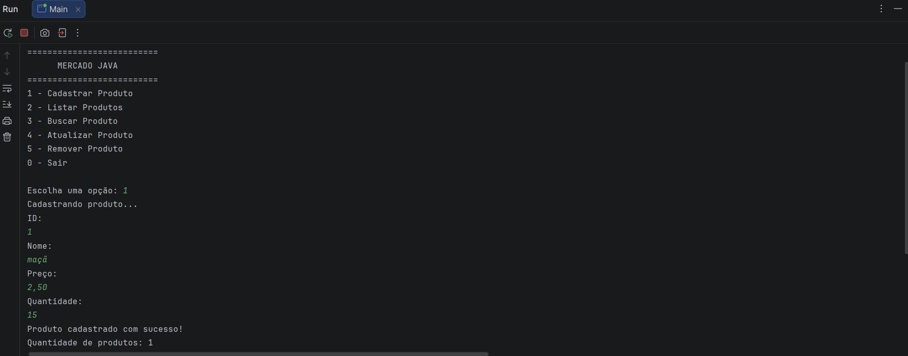
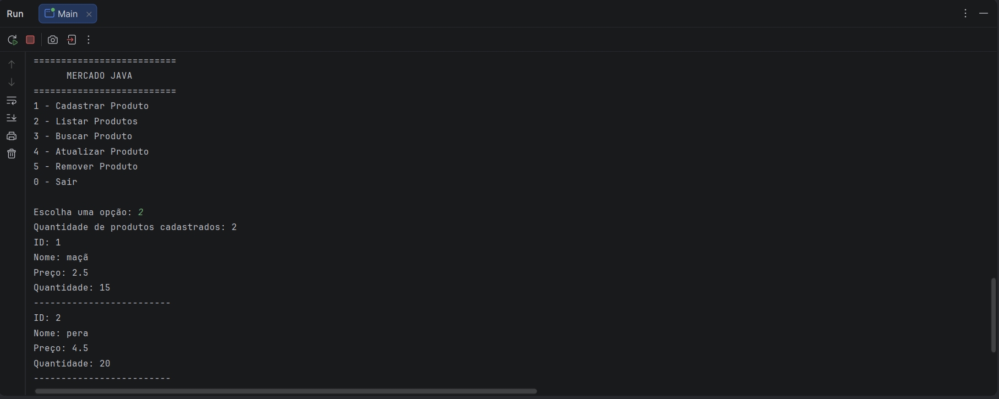
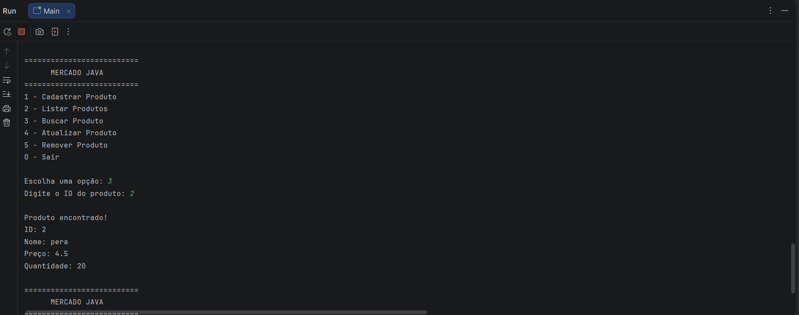
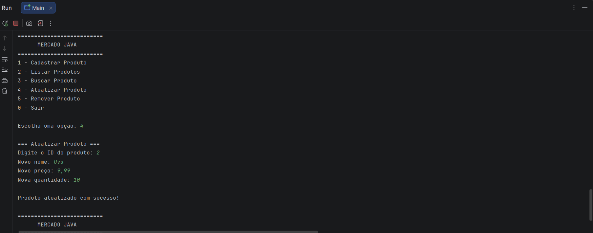
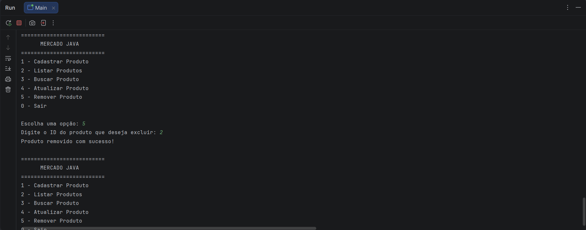

# 🛒 Mini Mercado Java

<p align="center">


</p>

---

# 📖 Sobre o Projeto

O **Mini Mercado Java** é um projeto desenvolvido com o objetivo de praticar e consolidar os principais conceitos da linguagem Java e da Programação Orientada a Objetos (POO).

O sistema foi desenvolvido inicialmente como uma aplicação de terminal e está sendo evoluído gradativamente para um projeto mais completo, seguindo boas práticas de desenvolvimento, organização de código, arquitetura de software e versionamento com Git.

Além de praticar Java, este projeto documenta minha evolução durante os estudos.

---

# 📸 Demonstração

## ➕ Cadastro de Produto

<p align="center">

</p>

---

## 📋 Listagem de Produtos

<p align="center">

</p>

---

## 🔍 Busca por ID

<p align="center">

</p>

---

## ✏️ Atualização de Produto

<p align="center">

</p>

---

## ❌ Exclusão de Produto

<p align="center">

</p>

---

# 🎯 Objetivos

- Aprender Java na prática
- Aplicar Programação Orientada a Objetos
- Desenvolver lógica de programação
- Criar um projeto do zero
- Praticar boas práticas de desenvolvimento
- Evoluir continuamente o projeto
- Utilizar Git e GitHub profissionalmente

---

# 🚀 Tecnologias Utilizadas

- ☕ Java
- 💻 IntelliJ IDEA
- 🌱 Git
- 🐙 GitHub

---

# ▶️ Como Executar

Clone o repositório

```bash
git clone https://github.com/davimj99/MercadoJava.git
```

Entre na pasta

```bash
cd MercadoJava
```

Abra o projeto no IntelliJ IDEA.

Execute a classe:

```text
Main.java
```

---

# 📂 Estrutura do Projeto

```text
src
└── br
    └── com
        └── davi
            └── mercado
                │
                ├── dominio
                │   └── Produto.java
                │
                ├── service
                │   └── ProdutoService.java
                │
                ├── repository
                │
                ├── test
                │
                └── Main.java
```

---

# 🏗️ Arquitetura

```text
Main
│
├── Interação com usuário
│
▼
ProdutoService
│
├── Cadastro
├── Listagem
├── Busca
├── Atualização
└── Exclusão
│
▼
Produto
```

---

# ✅ Funcionalidades

- ✔ Cadastro de produtos
- ✔ Listagem de produtos
- ✔ Busca por ID
- ✔ Atualização de produtos
- ✔ Exclusão de produtos
- ✔ Menu interativo
- ✔ Encapsulamento
- ✔ Arrays de Objetos
- ✔ Organização em pacotes

---

# 🚧 Próximas Melhorias

- Controle de estoque
- Categorias de produtos
- Validação de dados
- Tratamento de exceções
- Collections
- Persistência em arquivos
- Banco de dados com JDBC
- Sistema de vendas
- Relatórios
- Testes unitários
- Spring Boot
- API REST

---

# 📚 Conceitos Estudados

| Conceito | Status |
|----------|--------|
| Variáveis | ✅ |
| Tipos Primitivos | ✅ |
| Operadores | ✅ |
| Estruturas Condicionais | ✅ |
| Estruturas de Repetição | ✅ |
| Arrays | ✅ |
| Métodos | ✅ |
| Classes | ✅ |
| Objetos | ✅ |
| Encapsulamento | ✅ |
| Getters e Setters | ✅ |
| Associação | ✅ |
| Arrays de Objetos | ✅ |
| Construtores | ✅ |
| Herança | 🚧 |
| Polimorfismo | ⏳ |
| Classes Abstratas | ⏳ |
| Interfaces | ⏳ |
| Exceptions | ⏳ |
| Collections | ⏳ |
| Generics | ⏳ |
| JDBC | ⏳ |
| API REST | ⏳ |

---

# 📖 Aprendizados

Durante o desenvolvimento deste projeto pratiquei:

- Programação Orientada a Objetos
- Encapsulamento
- Construtores
- Arrays de Objetos
- Organização em camadas
- Git Flow
- Pull Requests
- Conventional Commits
- Documentação de projetos com README

---

# 🗺️ Roadmap

## ✅ Versão 1.0

- Cadastro de produtos
- Listagem de produtos
- Busca por ID
- Atualização por ID
- Remoção de produtos
**Status:** ✅ Concluído

---

## 🚧 Versão 2.0

- Controle de estoque
- Exceptions
- Collections
- Melhor organização em camadas

---

## ⏳ Versão 3.0

- Persistência em arquivos

---

## ⏳ Versão 4.0

- JDBC
- Banco de dados relacional

---

## ⏳ Versão 5.0

- Spring Boot
- API REST

---

# 🌿 Git Flow

O projeto utiliza um fluxo baseado em branches para organizar o desenvolvimento.
Estrutura atual:

```text
main
│
├── feature/Produto
│
└── feature/README
└── Release v1.0.0
```

Fluxo utilizado:

```text
feature/*
      │
      ▼
 Desenvolvimento
      │
      ▼
 Conventional Commit
      │
      ▼
 Push
      │
      ▼
 Pull Request
      │
      ▼
 Squash Merge
      │
      ▼
 main
```

---

# 📈 Evolução

Este projeto acompanha minha evolução durante os estudos de Java.

Cada nova funcionalidade é desenvolvida em uma branch específica, revisada através de Pull Request e integrada ao projeto principal utilizando Git Flow.

O objetivo é evoluir esta aplicação de terminal para uma aplicação completa utilizando banco de dados, Spring Boot e API REST.

---

# 🤝 Contribuição

Este é um projeto de estudos.

Sugestões, melhorias e feedbacks são sempre bem-vindos.

---

# 👨‍💻 Autor

<div align="center">

## Davi Souza

Back-end Developer

[](https://www.linkedin.com/in/davisouza99/)

[](https://github.com/davimj99)

</div>

---

<p align="center">

⭐ Se gostou do projeto, considere deixar uma estrela no repositório!

</p>
